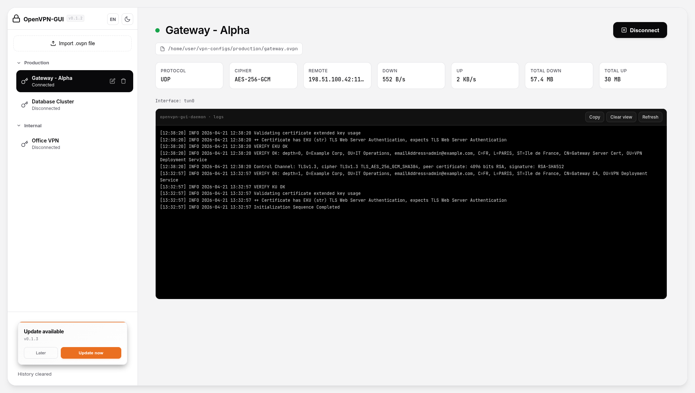

# OpenVPN GUI

[](https://opensource.org/licenses/MIT)
[](https://www.rust-lang.org/)
[](https://nodejs.org/)
[](https://tauri.app/)

OpenVPN GUI is a modern desktop application built with **Tauri 2** (TypeScript frontend, Rust backend). On Linux, it communicates with a separate **`openvpn-gui-daemon`** service over a **Unix socket**. This architecture ensures that the GUI does not require elevated privileges to manage OpenVPN processes.



## Key Features

- **Secure Profile Management**: Import and manage `.ovpn` profiles with custom display names and folder-based grouping.
- **Advanced Organization**: Support for **drag-and-drop** reordering of profiles and groups.
- **Real-time Monitoring**: Live OpenVPN log streaming with integrated terminal controls and a premium status indicator.
- **Collapsible Workspace**: Foldable logs and history sections to focus on what matters.
- **Traffic Statistics**: Instant bitrate and session-total data (download/upload) captured via `/proc/net/dev` for `tun`/`tap` interfaces.
- **Auto-Update**: Seamlessly stay up to date with built-in version checking and automated installation.
- **Session History**: Persistent event log tracking connection attempts and status changes.
- **Modern UI**: Responsive design with high-contrast **light** and **dark** modes, featuring subtle animations for a premium feel.


## Architecture

The application is split into three main components to ensure privilege separation and security.

```ansi
┌─────────────┐   Tauri IPC    ┌──────────────┐   Unix socket    ┌────────────────────┐
│  Frontend   │ <────────────> │ Tauri Core   │ <──────────────> │ openvpn-gui-daemon │
│   (TS)      │    invoke()    │   (Rust)     │   JSON / Unix    │  (System Service)  │
└─────────────┘                └──────────────┘                  └─────────┬──────────┘
                                                                           │ spawns
                                                                           v
                                                                   ┌──────────────────┐
                                                                   │  openvpn binary  │
                                                                   └──────────────────┘
```

1. **Frontend**: A lightweight TypeScript interface running inside the Tauri WebView.
2. **Tauri Core**: Orchestrates the UI window and acts as a bridge for the Unix socket communication.
3. **System Daemon**: A dedicated Rust service that manages OpenVPN processes and requires administrative rights for network configuration.

## Security Model

The `openvpn-gui-daemon` uses `SO_PEERCRED` to verify the identity of the connecting user. Only the user specified in the configuration (`allowed_uid`) can control the VPN. The systemd unit is hardened with `ProtectHome=read-only` to allow access to configuration files while protecting user data.

## Prerequisites

- **OpenVPN v2.x** (v3 is not currently supported)
- **Rust** toolchain (for building from source)
- **Node.js** and **npm** (for frontend development)
- **Systemd**-based Linux distribution

## Installation

The recommended way to install OpenVPN GUI is using the pre-built packages available on the [GitHub Releases](https://github.com/sylecium/OpenVPN-GUI/releases) page.

### 1. Using Pre-built Packages

#### Debian / Ubuntu (`.deb`)
Download the `.deb` package and install it using `apt` (which handles dependencies automatically):
```bash
sudo apt update
sudo apt install ./openvpn-gui_0.1.3_amd64.deb
```

#### Fedora / RHEL / CentOS (`.rpm`)
Download the `.rpm` package and install it using `dnf`:
```bash
sudo dnf install ./openvpn-gui-0.1.3-1.x86_64.rpm
```

> **Note**: The packages automatically handle the installation of the `openvpn-gui-daemon` binary, the systemd service configuration, and the initial setup of the communication socket.

### 2. Building from Source (Advanced)

If you prefer to build the application manually, follow these steps:

#### Building the GUI Package
```bash
npm install
npm run build:deb # Produces a .deb package in src-tauri/target/release/bundle/deb
```

#### Installing the Daemon Manually
If you are not using the `.deb` or `.rpm` packages, you must install the backend service manually:
```bash
npm run daemon:install
```

This script will:
- Compile the `openvpn-daemon` in release mode.
- Install the binary to `/usr/sbin/openvpn-gui-daemon`.
- Configure `/etc/openvpn-gui/daemon.toml` with your current **UID**.
- Setup and start the **systemd** service.

To check the service status:
```bash
npm run daemon:status
```

## Development

To start the application in development mode with hot-reload:

```bash
npm run tauri dev
```

## Release Workflow

This project uses **Conventional Commits** and **GitHub Actions** for automated releases.

To prepare a new release:
1. Run `npm run release -- <patch|minor|major>` to bump versions and create a tag.
2. Run `git push origin main --tags` to trigger the CI.

The GitHub Action will automatically:
- Build the application and the daemon.
- Package the `.deb` and `.rpm` installers.
- Create a **GitHub Release** with auto-generated change logs.

## Troubleshooting

### Socket Access Issues
If the GUI cannot connect to the daemon, verify the permissions of the communication socket:
```bash
ls -la /run/openvpn-gui/
```
The directory should be traversable (`0755`) and the socket writable. Access is enforced by the daemon via **UID verification**.

## License

This project is licensed under the **MIT License**.
